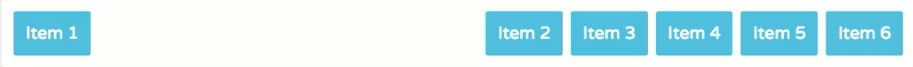

# Flexbox
Flexbox is a remarkable layout feature that's redefined how web designers build responsive layouts. With flexbox you can change the direction, size, and order of elements, like navigation links, content columns and images, regardless of their original size and order in the HTML.

## Resources
[A Complete Guide to Flexbox](https://css-tricks.com/snippets/css/a-guide-to-flexbox/)
[A Visual Guide to CSS3 Flexbox Properties](https://scotch.io/tutorials/a-visual-guide-to-css3-flexbox-properties)
[Flexbox Playground](https://scotch.io/demos/visual-guide-to-css3-flexbox-flexbox-playground)
[Flexbox - latest browser support](http://caniuse.com/#search=flexbox)

## Terminology
### Flex Container
  - Sets the context for flexbox layout
  - Contains flex items, the actual elements you layout using flex box
  - Can be any block-level or inline element

### Flex Item
  - Every direct child of a flex container
  - There can be any number of flex items inside of a flex container

### Flexbox Axes
  - Main axis: primary access, defines direction of flex-items, default is left to right
  - Cross axis: runs perpendicular to main access, default is top to bottom

## The Flexbox Layout
### Establish the flex formatting context
.container {
  - by default this creates a block-level flex container
  -  items inside will be laid out in a row from left to right, taking up the full height of the div
  
  display: flex;
}
  - a flex container can also be inline (wont fill an entire row)
display: inline-flex;

### Use `flex-direction` to establish the flow of the content
[flex-direction - MDN](https://developer.mozilla.org/en-US/docs/Web/CSS/flex-direction)
  - Note: flex-direction applies to the flex-container only, it wont have an effect if applied to a flex-item
.container {
  display: flex;
  flex-direction: row;   - this is the default, items are displayed horizontally from left to right
}

  - this will align the content horizontally, and in reverse order (right to left)
flex-direction: row-reverse;

  - column will cause the content to flow vertically instead of horizontally
flex-direction: column;
flex-direction: column-reverse;   - same as row-reverse, but from bottom to top

### Control whether flex-container is a single or multi-line layout with `flex-wrap`
[flex-wrap - MDN](https://developer.mozilla.org/en-US/docs/Web/CSS/flex-wrap)
.container {
  display: flex;
  flex-wrap: wrap;   - this will make content wrap to the next line when there isn't enough room to display items on one
}

  - default single-line, left to right
flex-wrap: nowrap; 

  - multi-line, right to left
flex-wrap: wrap-reverse;

### Control the position and alignment of items on the main access and how space should be distributed using `justify-content`
[justify-content - MDN](https://developer.mozilla.org/en-US/docs/Web/CSS/justify-content)
  - Note: justify-content applies to the flex-container only
.container {
  display: flex;
  justify-content: flex-end;   - this aligns flex items to the end of the flex line
}

  - default - items are placed at the beginning of the flex line
justify-content: flex-start;

  - items are centered along the line
justify-content: center;

  - items are evenly distributed in the line with the first item at the start and last item at the end of the line
justify-content: space-between;

  - items are evenly distributed in the line with equal space around them
justify-content: space-around;

  - in this example, `item-1` will be positioned all the way to the left, all other items will position to the right with equal space between them.
.container {
  display: flex;
  flex-wrap: wrap;
  justify-content: space-around;
}
.item-1 {
  margin-right: auto;
}

### Control the order of flex-items with `order`
[order - MDN](https://developer.mozilla.org/en-US/docs/Web/CSS/order)

